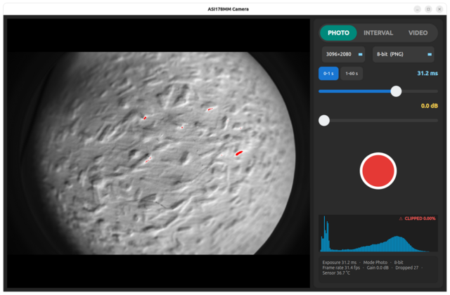
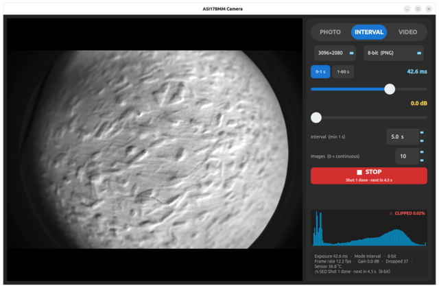
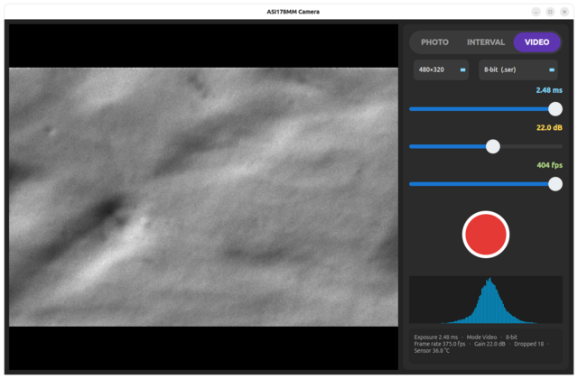

# ASI Camera App

Project article: [A Linux Capture App for the ZWO ASI178MM](https://hotto.de/software-hardware/a-linux-capture-app-for-the-zwo-asi178mm/)

## Use cases

1. **Infrared Photography and Video** — when using a mono camera like the
   ASI178MM, the unfiltered sensor sees near-infrared light as well as
   visible light; put an IR-pass (or visible-block) filter on the optics to
   pick the band, then capture IR stills in photo mode or full-frame IR
   video in video mode.
2. **All Sky Camera** — aim a fisheye lens at the sky and let interval mode
   take long-exposure sequences (up to 60 s per shot) at a fixed interval:
   timelapse material for the Milky Way, aurora, and cloud cover, with every
   frame saved as a 14-bit TIFF.
3. **Astro Photography** — exposures up to 60 s and fixed-interval sequences
   of 14-bit TIFF stills give stackable data for deep-sky imaging, with the
   live histogram and clipping warning helping to keep long exposures in
   range.
4. **High Speed Video** — when using the ASI178MM with a small ROI of
   480×320, high capture rates up to ~400 fps are achievable.

The three capture modes:

| **Photo** — single frames | **Interval** — exposure sequences | **Video** — H.264 MP4 or `.ser` recording |
|:---:|:---:|:---:|
|  |  |  |

A desktop app for **ZWO ASI cameras** on Linux (USB3, mono or colour). It is
built against the ZWO SDK in general — so it works with all ASI cameras — and
has been **developed and tested with the ASI178MM (mono) and the ASI178MC
(colour)**, both 3096×2080 sensors with 2.40 µm pixels. It has three capture
modes:

- **Photo** — snap single frames.
- **Interval** — back-to-back long-exposure sequences with a fixed **interval
  between shots** (the next shot starts `interval` seconds after the previous
  image was captured — the interval always elapses, even when the exposure is
  longer than the interval).
- **Video** — record **8-bit** clips as H.264 MP4, or **8/14-bit** clips as
  uncompressed `.ser` (full sensor bit depth, large files).

**Mono cameras save single-channel data; colour cameras save RGB.** Nothing is
chosen by hand and nothing is hard-coded: at startup the app asks the connected
camera what it is (its name, its sensor size, which resolutions and bit depths
it can read out, its exposure limits, its gain range, whether it has a Bayer
mosaic) and builds the panel from the answer. Plug a different ASI body in and
the selectors, labels and limits follow it.

| | a **mono** body (e.g. ASI178MM) | a **colour** body (e.g. ASI178MC) |
|---|---|---|
| Preview | grayscale (clipped pixels red) | colour (clipped blocks red) |
| Photo / Interval | 8-bit **1-channel PNG**, 14-bit **1-channel 16-bit TIFF** | 8-bit **RGB PNG**, 14-bit **RGB 16-bit TIFF** |
| Video H.264 | MP4 from grayscale frames | MP4 from RGB frames |
| Video `.ser` | `ColorID = 0` (**MONO**, 1 plane) | `ColorID = 100` (**RGB**, 3 channels interleaved per pixel: R,G,B) |

A colour camera is captured as its raw **Bayer mosaic** (1 byte/px on the fast
readout, 2 on the deep one) and demosaiced to RGB on the host — never as the
camera's own RGB24 readout, which costs 3 bytes/pixel at the *slow* rate and
would halve the frame rate for nothing. That means the saved RGB is the honest
mosaic data — with the camera's white balance baked in if you let it: **AWB is
on by default on a colour camera** (see the controls below), and what it (or
your manual sliders) do happens in the camera before the mosaic is read out.
Uncheck AWB and leave both sliders at their anchor (6500 K, tint 0) and the
balance stops moving on its own: it sits at the camera's **measured neutral** —
no colour cast under daylight-ish light, and no automatic decisions in your
frames. (The balance is always baked in on a colour camera; if you want the raw
mosaic with no in-camera colour processing at all, that is what a mono body is
for.)

The window shows a **live preview on the left** and **all controls in a large,
touch-friendly panel on the right** (dark theme). A 128-bin histogram sits in
the same panel, with the **clipping warning** painted in its top-right corner
(red `⚠ CLIPPED x.xx%`) and the clipped pixels marked red in the preview.

---

## Prerequisites (before compiling)

Everything the build needs comes from **system** development packages — the
Makefile resolves all compiler and linker flags through `pkg-config` against
them. The ZWO camera SDK is the one exception: it is a vendor distribution
(permissively licensed — see `ASI_SDK/license.txt`). The SDK pieces the
build needs — one `libASICamera2.so.1.41` per CPU architecture
(`ASI_SDK/x64/`, `ASI_SDK/armv6/`, `ASI_SDK/armv7/`, `ASI_SDK/armv8/`),
`ASICamera2.h` and the ZWO SDK `license.txt` — are committed in `ASI_SDK/`
at the project root, so there is **no installation** (no `ldconfig`, no
system paths) and nothing to download: the Makefile detects the build
machine's CPU (`uname -m`) and links the matching library, so the same
checkout builds on x86_64 desktops **and ARM boards** (Raspberry Pi,
Orange Pi — see the **Architecture** note below). (The full Linux/macOS SDK
v1.41 tree can be downloaded from ZWO (asi-cam.com) if other
architectures, e.g. macOS, are ever needed.) A camera is **not** needed to
build — only to run.

On **Ubuntu/Debian**, install:

```bash
sudo apt install g++ make pkg-config \
                 qt6-base-dev qt6-base-dev-tools \
                 libopencv-dev \
                 libgstreamer1.0-dev libgstreamer-plugins-base1.0-dev
```

| Package | What it provides | Why the app needs it |
|---|---|---|
| `g++` | the C++ compiler | the app is C++17 |
| `make` | the build driver | runs the Makefile |
| `pkg-config` | dependency flag resolver | supplies the Qt/OpenCV/GStreamer compile + link flags |
| `qt6-base-dev` | Qt 6 Widgets headers + libraries (`Qt6Widgets.pc`) | the entire GUI: widgets, timers, threads, signals |
| `qt6-base-dev-tools` | `moc`, Qt's meta-object compiler | the Makefile runs `moc` on the six `Q_OBJECT` headers (falls back to `/usr/lib/qt6/libexec/moc` if `moc` is not on `PATH`) |
| `libopencv-dev` | OpenCV 4.x | writes the PNG/TIFF stills and prepares preview frames for the encoder |
| `libgstreamer1.0-dev` | GStreamer 1.x core | the H.264 → MP4 video-encoding pipeline |
| `libgstreamer-plugins-base1.0-dev` | GStreamer app API (`gstreamer-app-1.0`) | feeds live frames into the pipeline via `appsrc` |

Notes:

- **Qt version** — no version is pinned: the build resolves `Qt6Widgets` via
  `pkg-config`, so any Qt 6 with the Widgets module works. It should match the
  system runtime (6.8.x on Ubuntu 24.04).
- **Other distros** — the same ingredients: a C++17 `g++`, `make`,
  `pkg-config`, Qt 6 Widgets + `moc`, OpenCV 4.x, and the GStreamer 1.0 core +
  app-API development packages.
- **No SDK install, no `ldconfig`** — the Makefile links the
  `libASICamera2.so.1.41` from `ASI_SDK/` directly and bakes an rpath into
  the binary, so the app finds the SDK at runtime on its own.

**Running** the app afterwards needs two more things (neither is needed to
compile):

1. The GStreamer **x264 encoder** plugin, for 8-bit H.264/MP4 video recording:
   `sudo apt install gstreamer1.0-plugins-ugly`. (8/14-bit `.ser` recording is
   plain C++ and needs no GStreamer plugins at all.)
2. Write access to the camera's USB device node — the one-time udev rule in
   [First time on a new machine](#first-time-on-a-new-machine).

## Building and running

```bash
make camera_app      # build
./camera_app         # run
./camera_app --smoke # headless self-test (needs the camera; exits 0 on success)
```

Four more self-tests run without a camera (developer use; see AGENTS.md):
`./camera_app --sertest` (`.ser` writer), `./camera_app --frametest` (preview
rendering), `./camera_app --capstest` (the resolution / bit-depth / frame-rate
model a camera is driven from) and `./camera_app --colourtest` (the Bayer→RGB
mapping for all four patterns, the RGB `.ser` frame order (per-pixel
interleaved R,G,B, pinned byte-for-byte and end to end), and the fact that a
mono body still writes exactly what it wrote before).

`make clean` removes the binaries, `build/`, `package/`, `samples/` — and the
`photos/`, `videos/`, `sequences/` output folders — so don't run it if you need
to keep your captures.

(If you're on a Wayland session and the window doesn't appear, launch it with
`DISPLAY=:0 QT_QPA_PLATFORM=xcb ./camera_app`.)

## First time on a new machine

The app needs write access to the camera's USB device node. Install the udev
rule **once per machine** so every ZWO camera (`03c3`) is world-writable:

```bash
sudo tee /etc/udev/rules.d/99-asi.rules <<'EOF'
SUBSYSTEM=="usb", ATTR{idVendor}=="03c3", MODE="0666"
EOF
sudo udevadm control --reload-rules && sudo udevadm trigger
```

Then (re)plug the camera. If the app shows "waiting for camera" on a machine
without this, see [Troubleshooting](#troubleshooting).

---

## The controls (right panel)

These are shared by all three modes:

| Control | What it does |
|---|---|
| **PHOTO / INTERVAL / VIDEO** | The mode switch (top of the panel). |
| **Image size** | Sensor region to use — full frame (3096×2080) down to smaller crops. Smaller regions give higher frame rates. The list is **probed at startup**: every size in it is one this camera actually accepted, and sizes are kept even so the Bayer phase of a colour sensor cannot shift. |
| **Bit depth** | The choices depend on the mode **and on what the camera can read out**. **Photo/Interval:** 8-bit → PNG, 14-bit → 16-bit TIFF. **Video:** 8-bit → H.264 MP4, or 8-bit / 14-bit → uncompressed `.ser`. (The two 8-bit video choices are H.264 MP4 or `.ser`.) On a colour camera every entry says so — "8-bit RGB (PNG)", "14-bit RGB (16-bit TIFF)", "8-bit RGB (H.264)", "14-bit RGB (.ser)" — because that is what lands on disk. A body with no 2-byte readout simply gets no deep entry. |
| **Exposure** | Logarithmic slider. Its range depends on the mode: **Photo/Interval** 32 µs…1 s (switch off) or 1…60 s (switch on), **Video** capped at the frame period (1/fps). In photo and interval mode the **Range** switch — on the exposure row, above the slider — toggles the range between **0-1 s** and **1-60 s** — pick 1-60 s for long exposures: in that range the slider is **linear with 1 s steps** (1 s at the left end, 60 s at the right, the handle snaps to whole seconds). Switching clamps the current exposure to the new range. The switch is shared between photo and interval mode — its state persists when you switch. **When the exposure exceeds one frame period, the live preview runs at the full exposure on the video stream**: the camera stretches its frame period to match the exposure, so the preview updates once per exposure and shows the true brightness — at 1 s it updates every second, at 60 s once a minute. Below the frame period the preview is the normal fast video stream. |
| **Gain** | Slider in **0.1 dB steps** that brightens/darkens the sensor signal — its range comes from the camera (the ASI178MM's 0.0…40.0 dB, the ASI178MC's 0.0…51.0 dB), so it cannot be pushed past what the body supports. Applies in all three modes — set it once and it stays (the camera keeps it between runs). |
| **White balance** *(colour cameras only)* | A row that appears as soon as a **colour** camera is connected: **AWB** — the camera's automatic white balance, **on by default** — plus **Temperature** (2500…10000 K) and **Tint** (−100 green … +100 magenta) sliders. While AWB is checked the sliders are greyed out and retain your last manual values. Unchecking AWB applies those values immediately. Dragging either slider changes the image as it moves, with camera updates paced to protect the video stream; releasing it applies the final value. The sliders have no tooltips. The two labels show **exactly the balance you set** — Temperature and Tint are fully independent: moving one never drags the other, and what the labels say is what you set (no asterisks). White-balance headroom is finite: where the camera cannot deliver the full balance, one channel runs into its cap and the other carries the balance, so the temperature axis stays true (blue↔yellow) and the image carries what the hardware allows. The Kelvin scale is anchored to the camera's **measured** neutral point. The balance is applied in the camera and is baked into saved files; on a mono camera the row never appears and the data stays exactly as it came off the sensor. |

Below the mode switch, the panel shows the controls for the selected mode.

---

## Photo mode

1. Pick the **image size** and **bit depth**.
2. Set the **exposure** with the slider (the value is shown next to it). For
   exposures above 1 s, press the **1-60 s** range switch on the exposure row
   (above the slider) first, then set the exposure.
3. Adjust the **gain** if the image is too dark or too bright (higher gain =
   brighter, but more noise).
4. Press the round shutter button (red circle with a white ring). It dims
   while the exposure is in flight.

The frame is saved to `photos/photo_<timestamp>.png` (8-bit) or
`.tif` (14-bit, 16-bit TIFF).

**Live view speed:** the preview is shown as a downscaled thumbnail (built on
a dedicated preview thread), while photos and recordings always stay
full-resolution. The preview refreshes at a fixed **~30 fps in every mode
(photo, interval, video) — independent of the recording frame rate**: recording
at 1 fps or 300 fps both give a 30 fps preview, and nothing is rebuilt more
often than 30 fps (faster would only waste CPU — the display repaints at 30 Hz
anyway). The 30 fps clock runs on a dedicated preview-builder thread, off the
frame-drain loop. OpenCV's thumbnail resize uses one internal worker so its CPU
work does not interrupt the camera stream. The preview can only show frames the
camera actually delivered: at full frame the camera delivers ~60 fps (8-bit,
the fast 10-bit readout) to ~28 fps (14-bit), so the 30 fps preview is fully
supplied there; if the camera delivers slower (e.g. a slow photo exposure shows
at 1/exposure, a running sequence once per shot), the preview updates at that
slower rate until frames arrive again.

## Interval mode

Back-to-back long-exposure captures. **There is no separate exposure control** —
the sequence uses the **main exposure slider** and its **Range** switch
(0-1 s / 1-60 s, exactly like photo mode), so set your exposure there first.

1. Set the **exposure** with the main slider (top of the panel). For exposures
   above 1 s, press the **1-60 s** range switch on the exposure row (above the
   slider) first (the slider is then linear with whole-second steps).
 2. Set the **Interval** — the time between shots (1 s minimum, up to 1200 s).
    It is the gap that always elapses after each image is captured, *before* the
    next exposure starts — independent of how long the exposure is.
 3. Set **Images** — how many shots to take (**0 = continuous** until you stop).
 4. Press **▶ START SEQUENCE** (it turns red **■ STOP** while running).
 
 **How the timing works:** the next shot starts exactly `interval` seconds after
 the previous image was captured (i.e. after its exposure finished). The interval
 is the time *between* images, so it always elapses, even when the exposure is
 longer than the interval. Total time per shot ≈ `exposure + interval`:
 
 - 0.5 s exposure, 5 s interval → 5 s between images (exposure, then the full
   5 s interval).
 - 30 s exposure, 5 s interval → the 30 s exposure is followed by the full 5 s
   interval (35 s between images) — the interval is *not* skipped just because
   the exposure is long.
 
 While a sequence runs the live preview is paused; it resumes when the sequence
 finishes or you press **■ STOP**. Images save to
 `sequences/seq_<timestamp>/NNNN.<ext>` (zero-padded shot number, PNG or 14-bit
 TIFF as set by the bit depth). The button shows the current shot, the count,
 and a live countdown to the next one — it counts the interval down after every
 image, and while the next exposure itself runs the line shows
 “Exposing shot N / M…”.

## Video mode

1. Pick the **frame rate** with the slider. Its maximum depends on the image size
   **and** the bit-depth/format (from the camera's USB3.0 spec): 8-bit H.264 tops
   out at **60 fps**; 14-bit `.ser` follows the 14-bit spec column; 8-bit
   `.ser` follows the faster 10-bit column. The exposure is automatically capped at
   the frame period (you can't expose longer than one frame).
2. Pick the **bit depth**: **8-bit (H.264)** — small compressed MP4 — or
   **8-bit / 14-bit (.ser)** — uncompressed, full sensor bit depth, large files
   (interleaved RGB = 3 bytes/px on a colour camera, so three times the bytes of mono).
3. Press **● RECORD** (it turns red **■ STOP** while recording).

8-bit H.264 video is written to `videos/video_<timestamp>.mp4`. 8/14-bit `.ser`
video is written to `videos/video_<timestamp>.ser` (uncompressed — 8-bit stores
1 byte/plane/pixel, 14-bit 2; a colour body writes 3 channels **interleaved per
pixel (R,G,B)** — the layout SER v3 defines for `ColorID 100` and the one Siril,
Ser-Player and FireCapture-style tools read (full R/G/B planes render as a
3×3 mosaic of the scene in those players), a mono body
1; the largest files, so disk writes are the bottleneck). Higher frame rates need a smaller image size — full-resolution
video tops out at ~28 fps (14-bit) to ~60 fps (8-bit, the fast 10-bit readout),
and small image sizes run much faster (up to ~400 fps at 480×320 on the 10-bit
readout). The live preview is unaffected by the frame-rate slider: it always
runs at a fixed ~30 fps while recording (and in every other mode), whatever
the recorded rate.

**14-bit `.ser` and stacking tools.** 14-bit `.ser` stores 2 bytes/pixel with
the value **left-justified (MSB-aligned)** in the 16-bit container (the 14-bit
readout as-is, 0…65528), and the header declares `PixelDepthPerPlane = 16` —
the container width — rather than 14. That is the one representation every
`.ser` reader decodes to a correct full-range image: Siril reads the 16-bit
word as-is (and always labels its own 2-byte files 16-bit), while tools that
shift or normalise by the declared depth do nothing at all for 16. Declaring 14
instead makes depth-aware tools clip the image to white or render it at
1/4…1/64 brightness. The pixel data is little-endian, and the header's
`LittleEndian` field (offset 22) is written **0** — the de-facto convention of
the original SER tools, Siril and GoQat, where 0 means "little-endian data"
(the spec's written meaning of the flag is the opposite; writing 1 makes those
readers byte-swap every pixel and the image comes out as noise). The effective
bit depth is implicit in the data (values top out at 65528, in steps of 4), so
nothing is lost — the sensor's full range is preserved.

---

## Where files go

Output is written to folders **next to where you launch the app**:

| Mode | Folder | File naming |
|---|---|---|
| Photo | `photos/` | `photo_<yyyyMMdd_HHmmss>.png` / `.tif` |
| Interval | `sequences/` | `seq_<yyyyMMdd_HHmmss>/NNNN.png` / `.tif` |
| Video | `videos/` | `video_<yyyyMMdd_HHmmss>.mp4` (8-bit H.264) / `.ser` (8/14-bit, MONO or RGB) |

**14-bit** stills (Photo and Interval) are saved as **16-bit TIFF** so the full
sensor range is preserved. **8-bit H.264 video** is a small compressed MP4;
**8/14-bit `.ser` video** is uncompressed, so the full bit depth is preserved
there (at the cost of large files). A colour camera's files hold **RGB** —
3-channel PNG/TIFF and 3-plane `.ser` (`ColorID = 100`, planes in the order
R, G, B) — a mono camera's hold a **single channel** (`ColorID = 0`).

---

## Troubleshooting

- **Camera not found / "waiting for camera".** First make sure no other
  instance of the app (or any other program) is holding the camera — only one
  process can hold it at a time. If the camera is clearly connected (check with
  `lsusb`, it shows as `03c3:…`) but the app still waits, the usual cause is
  device permissions: the node `/dev/bus/usb/NNN/NNN` exists but is
  `root:root 0664`, so a regular user cannot open it. One-time fix — install a
  udev rule that makes all ZWO cameras (USB vendor `03c3`) world-writable:

  ```bash
  sudo tee /etc/udev/rules.d/99-asi.rules <<'EOF'
  SUBSYSTEM=="usb", ATTR{idVendor}=="03c3", MODE="0666"
  EOF
  sudo udevadm control --reload-rules && sudo udevadm trigger
  ```

  Then unplug and replug the camera (or just relaunch the app). A one-off
  `sudo chmod 0666 /dev/bus/usb/NNN/NNN` works too, but the `NNN/NNN` numbers
  change on every re-plug, so the rule is the durable fix.
- **Camera lost / "stuck".** The camera's USB connection can re-enumerate
  (wobbly cable, re-plug, or the brief "stuck" state seen right after closing the
  app). The app now detects a lost camera, shows a red
  **"Camera lost - reconnecting..."** status line, and re-opens the camera on its
  own the moment it answers again — no restart needed. At startup the same
  applies: if the camera is unavailable (e.g. its `/dev` node is missing), the
  app waits and re-probes every second, so creating the node while the app is
  open is enough — read the node's `major minor` from
  `/sys/bus/usb/devices/usb<bus>/<bus>-<port>/dev` (the camera's entry under
  `/sys/bus/usb/devices/`, found via `lsusb`) and run
  `sudo mknod -m 0666 /dev/bus/usb/<bus>/<dev> c <major> <minor>`.
- **8-bit H.264 video recording errors / no MP4.** GStreamer loads the encoder
  plugins (`x264enc`, …) at runtime, so make sure `gstreamer1.0-plugins-ugly` is
  installed (see Prerequisites). A `gst: …` message on the console when
  recording starts means the x264 encoder plugin is missing or not registered.
  (8/14-bit `.ser` recording is plain C++ and needs no GStreamer plugins at all.)
- **8/14-bit `.ser` files are large.** `.ser` is uncompressed (8-bit: 1
  byte/pixel, 14-bit: 2 bytes/pixel): a full-resolution 14-bit clip is ~12.6 MB
  per frame, so disk space and write speed are the limit. Use a smaller image size
  or 8-bit H.264 MP4 for long clips.
- **Architecture.** The Makefile auto-detects the build machine's CPU
  (`uname -m`) and links the matching bundled SDK library — `ASI_SDK/x64/`
  on x86_64, `ASI_SDK/armv8/` on aarch64, `ASI_SDK/armv7/`/`armv6/` on
  32-bit ARM — so the same checkout builds on **x86_64 desktops and ARM
  boards**: Raspberry Pi 3/4/5 on a 64-bit OS (and aarch64 Orange Pi, e.g.
  Orange Pi 5) → `armv8`; Raspberry Pi 2/3/Zero 2 W or a 32-bit Orange Pi
  (e.g. Orange Pi One/Lite) on a 32-bit OS → `armv7`; Raspberry Pi 1 / Zero
  (32-bit) → `armv6`. To build on a Pi or Orange Pi, install the
  prerequisites above (the package names are the Debian/Ubuntu/Raspberry Pi
  OS ones — Orange Pi's Debian/Armbian images use the same names) and run
  `make`; force the architecture with `make ARCH=armv8` if you ever need
  to. A `package/` (or binary) built for one architecture only runs on
  machines of the same architecture.
- **Colours look wrong on a colour camera (skin tones cyan, R and B swapped).**
  The app demosaices with the Bayer pattern the camera reports. A rare body
  reports a pattern that does not match its data; `./camera_app --bayer rggb`
  (also `bggr`, `grbg`, `gbrg`) forces the order, so it can be checked without
  rebuilding. The headless `--colourtest` pins the mapping itself down, so a
  mismatch there is a camera-reporting issue, not a code issue.
- **Clipping.** If the red **⚠ CLIPPED x.xx%** readout appears in the
  histogram's top-right corner, part of the frame is at the sensor's maximum
  value (over-exposed); reduce the exposure.

---

## Developer notes

For the build system, architecture, threading model, and internal behaviour see
**[AGENTS.md](AGENTS.md)**.

The source is split into modules: `include/` (one header per module),
`src/` (one `.cpp` per module), and `tests/` (the headless self-test suites
driven by `--sertest` / `--frametest` / `--capstest` / `--colourtest`).
`camera_caps` is what the camera reports and everything the UI derives from it;
`colour` is the Bayer→RGB path (demosaic to interleaved RGB for `.ser`, colour
thumbnail). The Makefile runs `moc` on the `Q_OBJECT` headers; all generated
build artifacts live in `build/`.
